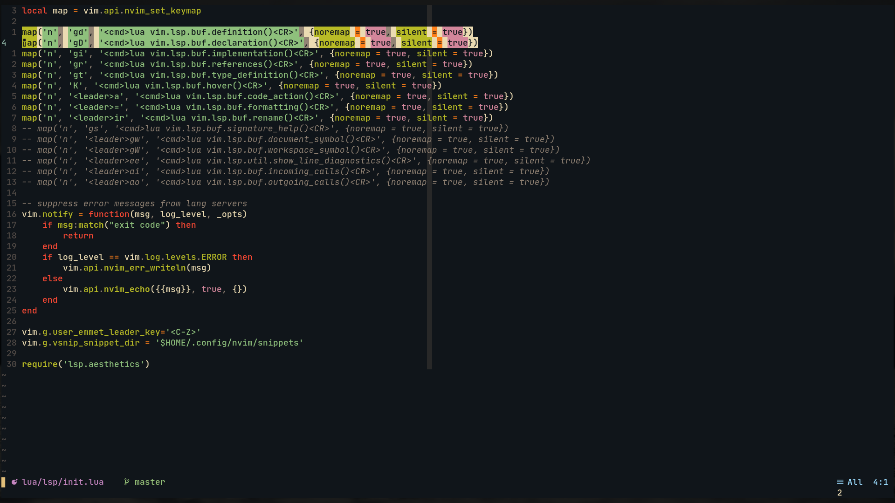
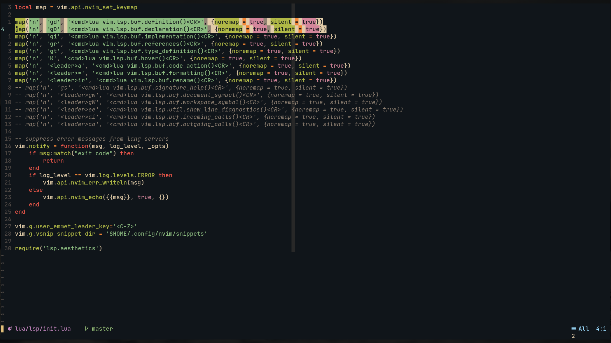
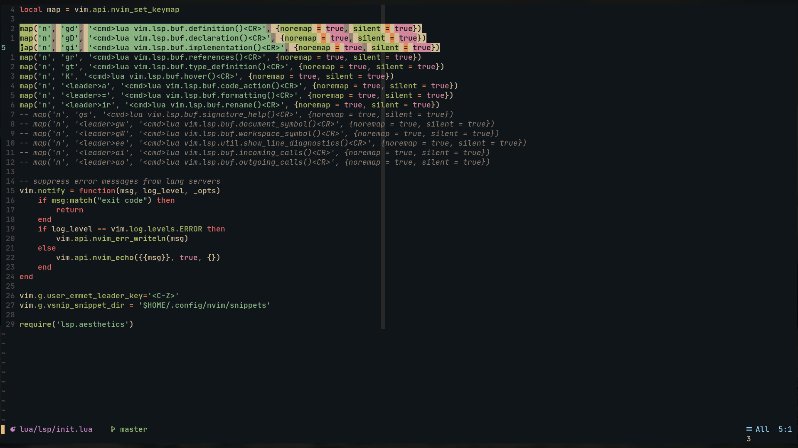

# Gruvqueen
> Port of famous gruvbox theme in lua(inspired by [gruvbox-material](https://github.com/sainnhe/gruvbox-material))

* original


* mix


* material


** font☝️ : [JetBrains Mono Nerd Font](https://www.nerdfonts.com/font-downloads)


## ⭐Features
* 3 styles to choose from - original, mix, material
* configurable


## Requirements
* Neovim >= 0.5


## Installation
* packer
```bash
use 'Murtaza-Udaipurwala/gruvqueen'
```

* vim-plug
```bash
Plug 'Murtaza-Udaipurwala/gruvqueen'
```


## 🚀Usage
```lua
require("gruvqueen").setup({
    config = {
        disable_bold = true,
        italic_comments = true,
        italic_keywords = true,
        italic_functions = true,
        italic_variables = true,
        invert_selection = false,
        style = 'mix', -- possible values: 'original', 'mix', 'material'
        -- transparent_background = true,
        -- bg_color = "black",
    },
})
```

```vim
let g:gruvqueen_transparent_background = v:false
let g:gruvqueen_background_color = '#10151a'
let g:gruvqueen_disable_bold = v:false
let g:gruvqueen_italic_comments = v:true
let g:gruvqueen_italic_keywords = v:true
let g:gruvqueen_italic_functions = v:true
let g:gruvqueen_italic_variables = v:true
let g:gruvqueen_invert_selection = v:true
let g:gruvqueen_style = 'mix' " possible values: 'original', 'mix', 'material'

colorscheme gruvqueen
```

## 💥Modify highlights
* All your custom highlights can be passed to `gruvqueen` through a lua table
* Checkout [palette.lua](lua/gruvqueen/palette.lua) for list of all available colors

```lua
require("gruvqueen").setup({
    palette = { -- checkout `palette.lua`
        grey0 = "#7c6f64",
        bg1 = "#282828",
    },

    -- basic highlights
    base = {
        Number = {fg = "purple", style = "italic"},
        Float = {fg = "#d3869b", bg = c.none},

        -- syntax:
        -- highlight_group = {fg = "...", bg = "...", style = "..."}
    },

    treesitter = {
        ...
    },

    lsp = {
        ...
    },

    -- filetype highlights
    ft = {
        ...
    },

    plugins = {
        ...
    },
})
```

Example: Changing styles for `LspDiagnosticsVirtualText`
```lua
require("gruvqueen").setup({
    lsp = {
        LspDiagnosticsVirtualTextError = {style = "underline"},
        LspDiagnosticsVirtualTextWarning = {style = "underline"},
        LspDiagnosticsVirtualTextInformation = {style = "underline"},
        LspDiagnosticsVirtualTextHint = {style = "underline"},
    },
})
```

## tmux(fix undercurl)
```tmux.conf
set -g default-terminal "tmux-256color"
set -ag terminal-overrides ",xterm-256color:RGB"
set -as terminal-overrides ',*:Smulx=\E[4::%p1%dm'  # undercurl support
set -as terminal-overrides ',*:Setulc=\E[58::2::%p1%{65536}%/%d::%p1%{256}%/%{255}%&%d::%p1%{255}%&%d%;m'  # underscore colours - needs tmux-3.0
```


## 🤩Supported plugins
* Treesitter
* LSP
* Telescope
* IndentBlankLine
* gitsigns.nvim
* vim-easymotion
* nvim-ts-rainbow
* nvim-tree
* undotree
* startify


## TODO
* [x] provide option to disable `bold`
* [x] well defined method to configure colorscheme
* [ ] support for more plugins
* [ ] Light theme


## Note
* Specify all your configuration before calling `vim.cmd("colorscheme gruvqueen")`


#### All PR are welcomed😄. Open Issues for discussions/bugs.
